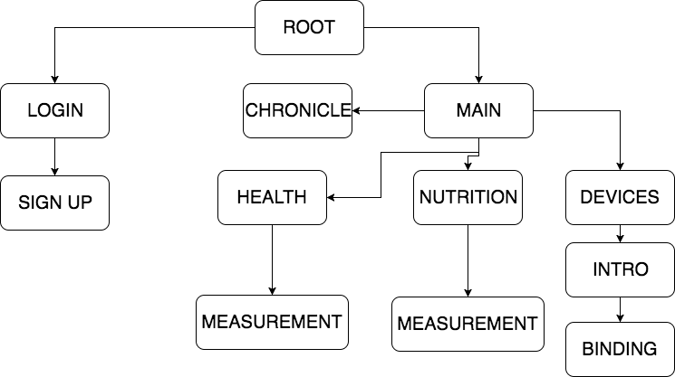

# <center> Fractal MVVM </center>

<center> Dzmitry Liausevich </center> 

+++

## VISION

* App as tree
* Every subtree is an app
* Organized the same way on all scales
* Unidirectional bindings VM -> V

+++

## PROFITS

* Reusable
* Testable
* Maintainable

+++

## APP AS TREE



+++

## VIEW MODEL

```Swift
struct RootViewModel {
	init(dependencies: Dependencies, context: Context) {
		// ...
	}
    
	struct Dependencies {
		let title : String
		// ...
	}

	struct Context {
		let imageService: ImageService
		// ...
	}
    
    // ...
}
```

+++

## PRESENTING THINGS IN SWIFT

``` Swift

protocol Presentable {
  associatedtype Presenters
  associatedtype AnyPresentable = AnyPresentableType<Presenters>
  var present: (Presenters) -> Disposable? { get }
}

// ...

extension RootViewModel: Presentable {
	// ...
}

```

+++

## DISPOSABLE

``` Swift
//  Disposable.swift
//  ReactiveCocoa

/// Represents something that can be “disposed,” usually
/// associated with freeing resources or canceling work.

public protocol Disposable {
  /// Whether this disposable has been disposed already.
  var disposed: Bool { get }
  func dispose()
}

```

+++

## PRESENTER 

``` Swift
protocol PresenterType {
    associatedtype ViewModel
    var presenter: Presenter<ViewModel> { get }
}

final class Presenter<T>: PresenterType {
    typealias ViewModel = T
    fileprivate let bind: (ViewModel) -> Disposable?
    var presenter: Presenter { return self }

    func present(_ viewModel: ViewModel) -> Disposable? {
        return bind(viewModel)
    }

    fileprivate init(_ bind: @escaping (ViewModel) -> Disposable?) {
        self.bind = bind
    }
}


```

+++

## UI PRESENTER

``` Swift 
extension Presenter {
  static func UI(bind: T -> Disposable?) -> Presenter {
    return Presenter { viewModel in
      let disposable = CompositeDisposable()
      disposable += UIScheduler().schedule {
          disposable += bind(viewModel)
      }
      return disposable
    }
  }
}
	
```

+++

## PRESENTER TYPES


* ``Presenter<String>``
* ``Presenter<String -> ()>``
* ``Presenter<()->()>``
* ``Presenter<Action<Void, Void, NoError>>``

+++

## PRESENTERS

* extendable 
* solves repeating presentation patterns (.serial(), .optional)
* restrictive constructors for app and test target
* easy to inject

+++

<style>
.reveal pre {
  line-height: 1.0em;
  font-size: 0.4em
}
  
.reveal pre code {
  max-height: 700px;
}
</style>

``` Swift 
struct RootViewModel {
  init(dependencies: Dependencies, context: Context) {
    self.child = dependencies.authServices.authorized.map {
      childViewModel(forState: $0)
    } 
  }
  
  private let child: Property<Child>
}

extension RootViewModel: Presentable {
  typealias Presenters = <
        LoginPresenterContainer,
        MainPresenterContainer>
        
  var present: Presenters -> Disposable? {
    let childPresenter = ...
    return { presenters in
      childPresenter.serial().present(self.child.producer)
    }
  }
  
  enum Child {
    case login(LoginViewModel)
    case main(MainViewModel)
  }
}

```
+++

## CHILD PRESENTER

``` Swift 
let childPresenter = Presenter<Child>.UI {
  switch $0 {
  case .login(let viewModel):
    return presenters.login <~ viewModel
  case .main(let viewModel):
    return presenters.mainPresenter <~ viewModel
  }
}
```

+++

<style>
.reveal pre {
  line-height: 1.0em;
  font-size: 0.4em
}
  
.reveal pre code {
  max-height: 700px;
}
</style>

```Swift
final class TextViewModel {
    let text: Property<String?>
    let backAction: Action<(), (), NoError>
    let textInput: (String?) -> ()

    init(dependencies: Dependencies, context: Context) {
        let text = MutableProperty<String?>(nil)
        let input = { text.value = $0 }
        self.textInput = input
        self.backAction = dependencies.backAction
        self.text = Property(text)
    }
    
    struct Dependencies {
        let backAction: Action<(), (), NoError>
    }
    struct Context {}
}

extension TextViewModel: Presentable {
    typealias Presenters = TextViewModelPresenterContainer

    var present: (TextViewModelPresenterContainer) -> Disposable? {
        return { presenters in 
            return CompositeDisposable([
                presenters.titlePresenter <~ "Text",
                presenters.textPresenter.serial().optional() <~ self.text,
                presenters.textInputPresenter <~ self.textInput,
                presenters.backActionPresenter <~ self.backAction
                ])
        }
    }
}
```

+++

### PRESENTERS CONTIANER

```Swift
protocol TextViewModelPresenterContainer {
    var titlePresenter: Presenter<String> { get }
    var textPresenter: Presenter<String> { get }
    var textInputPresenter: Presenter<(String?) -> ()> { get }
    var backActionPresenter: Presenter<Action<(), (), NoError>> { get }
}
```

+++

* ``RootViewModel`` have same structure as children
* Create and manage child view model lifetime the way it fits a business case
* Disposables compose all the way up from leafs into the root disposable

+++

## WHO PROVIDE PRESENTERS

* Anything that conforms to Presenters protocol
* Usually UIView subclasses and controllers

+++

## PRESENTER EXAMPLES

``` Swift 
extension UITextField {
  var textPresenter: Presenter<String> {
    return Presenter.UI {
      self.text = $0
      return nil
    }
  }

  var textSinkPresenter: Presenter<(String) -> ()> {
    return Presenter.UI { sink in
      return self.reactive
          .continuousTextValues
          .skipNil()
          .observeValues(sink)
    }
  }
}
```

+++

## CHILD PRESENTER EXAMPLE

``` Swift
var mainPresenter: Presenter<MainViewModel.AnyPresentable> {
  return Presenter.UI { viewmodel in
    guard let window = self.window else { return nil }
    let main = UIStoryboard(name: "Main", bundle: nil)
        .instantiateViewController(withIdentifier: "MainScreen")
    as! MainViewController
    window.rootViewController = UINavigationController(rootViewController: main)
    window.makeKeyAndVisible()
    main.loadViewIfNeeded()
    return viewmodel <- main
  }
}
```

+++

## REFERENCES

* "Fractal MVVM in Swift", Sergey Anishchanka, 2016-04-16 CocoaHeadsBY meetup
* "Presenting Things in Swift", Denis Fileev, 2015-12-12 CocoaHeadsBY meetup
* https://github.com/ReactiveCocoa/ReactiveSwift
* https://medium.com/design-x-code/elmification-of-swift-af14b7f92b30
